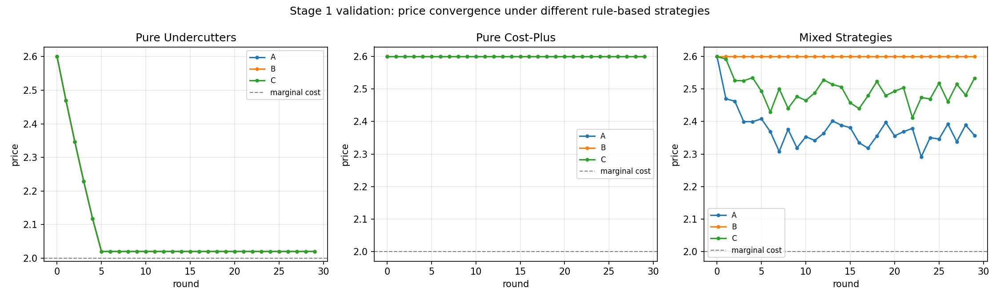

# LLM Agent Market Simulator

**Research question:** when autonomous LLM agents set prices in a competitive
market, do they behave like textbook competitors (prices driven toward
marginal cost), or does something closer to tacit collusion emerge, even
without being told to cooperate?

This project builds a testbed to study that question. Multiple agents run
competing firms in a simulated market over many rounds. The market's
economics (demand, pricing, profit) are deterministic and hand-coded; only
the agents' *strategy* is LLM-driven. Varying what agents can see and
whether they can communicate lets us measure how information conditions
affect pricing behavior.

> **Status: Stage 3 in progress.** Isolated LLM agent condition
> replicated across two independent 8-seed batches (74.2% average
> markup). Connected condition pending a clean, larger rerun.
> See [Roadmap](#roadmap) below.

## Why this question matters

Algorithmic pricing is already widespread in e-commerce, ride-hailing, and
ad auctions. Research in economics has shown that reinforcement-learning
pricing agents can learn to sustain higher-than-competitive prices without
any explicit coordination, a form of "algorithmic collusion." As LLMs
increasingly get deployed as autonomous pricing/business agents, whether
they exhibit similar tendencies is an open, practically important question.
This project doesn't claim to settle it (it's a small, honest testbed, not
a research paper), but it's built to produce a real, falsifiable finding
rather than just a demo.

## Architecture

```
market_sim/
├── core/
│   ├── demand_model.py         # deterministic multinomial logit demand + profit
│   ├── environment.py          # round loop connecting agents to the market
│   └── agents/
│       ├── base.py             # Agent interface (Observation to Decision)
│       └── rule_agent.py       # baseline strategies: cost-plus, undercut, noisy-match
├── experiments/
│   └── stage1_baseline_runner.py  # scenario runner + CSV logging
├── analysis/
│   └── plot_baseline.py        # convergence visualization
├── tests/
│   └── test_demand_model.py    # 10 tests validating economic sanity
└── requirements.txt
```

**Design decision: deterministic economics, LLM-driven strategy only.**
The demand model (how price and marketing spend translate into market
share and profit) is a standard multinomial logit model, coded directly,
not learned. Only the agents' pricing/marketing *decisions* will be
LLM-driven from here on. This keeps results reproducible and testable,
keeps API costs bounded, and means any collusion-like signal found later
comes from agent behavior, not from quirks in the simulated market itself.

## Stage 1: validating the deterministic core

Before introducing any LLM, the underlying economic model needs to behave
the way theory predicts, otherwise there's no way to tell later whether
LLM agents are doing something interesting or the simulation is just
broken.

**10 unit tests** (`tests/test_demand_model.py`) check the demand model's
basic economic sanity: market shares stay in [0,1], cheaper firms win more
share, higher marketing spend increases share, pricing at marginal cost
yields zero profit, pricing below cost yields negative profit, etc. All 10
pass.

**Three rule-based scenarios** (`experiments/stage1_baseline_runner.py`)
validate system-level behavior, run for 30 rounds each with identical
marginal costs ($2.00):

| Scenario | Strategy | Result |
|---|---|---|
| Pure undercutters | Each firm undercuts the cheapest competitor by 5% | Price converges to **$2.02 (1.0% markup)**, Bertrand competition working as expected |
| Pure cost-plus | Each firm holds a fixed 30% markup | Price stable at **$2.60 (30% markup)**, no convergence pressure, as expected |
| Mixed strategies | Undercutter + cost-plus + noisy-match | Prices settle **between the two extremes** ($2.36 to $2.60), with the aggressive undercutter pulling the group down |



This confirms the simulation reproduces standard oligopoly pricing
dynamics before any LLM strategy is introduced, the necessary baseline
for everything that follows.

## Stage 3: multiple LLM agents, and comparing information conditions

The Agent interface was extended with an optional messaging channel:
agents can now see a short note from other agents' previous round, and
can optionally write one of their own for the next round. This required
no changes to the demand model or existing agents, only two new fields
on the existing Observation and Decision objects, a direct payoff of the
interface design from stage 1. 17 new tests cover the environment's
message passing and the LLM agent's conditional prompt content, all
without a live API key.

Two conditions were compared: **isolated** (three LLM agents, no
visibility into competitor prices, no messaging) versus **connected**
(full visibility, messaging enabled).

**An important technical caveat, discovered while interpreting the
first results:** the environment's random seed controls Python's own
randomness, but not the LLM's. Every API call is made at temperature
0.7, so even repeated runs of the identical setup produce different
outcomes. A single run of each condition is not enough to trust; this
was confirmed directly when a second run of the same setup produced a
noticeably different result from the first. An initial hypothesis from
the first two runs, that agents kept independently landing on a price
of 3.75, also did not hold up once more data came in, a useful early
lesson in not trusting a pattern seen only once or twice.

**Two infrastructure bugs surfaced while trying to collect a larger,
more trustworthy batch of runs, both fixed:**

The first API rate limit hit (HTTP 429) exposed a design flaw: the
API call function retried internally with a growing backoff, while the
agent wrapped that entire thing in a second retry loop of its own.
Under sustained rate limiting the two multiplied together into several
real minutes of silent waiting for a single decision, indistinguishable
from the script being frozen. Fixed by bounding the inner backoff
tightly and adding a live per-round progress line, so a slow round can
never again look identical to a stalled one.

The second issue was a cumulative daily quota, not a pacing problem: a
large batch (8 seeds x 2 conditions x 3 agents x 10 rounds, roughly 480
calls) ran cleanly for the entire isolated condition, then began
failing partway through the connected condition, most likely because
the day's free-tier quota was exhausted by that point in the session.
Every failure was caught and flagged live rather than silently
corrupting the results, which is what made the contamination visible
and preventable rather than something that would have quietly produced
misleading final numbers.

**Isolated condition: replicated across two independent 8-seed batches
(16 seeded runs total), both completed with zero failures.** Averaging
each run's three agents first (see `analysis/stage3_stats.py` for why
this is the correct unit of comparison, not each agent separately):

| Batch | Mean markup | Std dev | Range |
|---|---|---|---|
| First batch | 75.0% | 8.1% | 62.5% to 87.5% |
| Second batch | 73.4% | 8.1% | 62.5% to 100.0% |
| **Combined (n = 16)** | **74.2%** | **8.1%** | **62.5% to 87.5%** (per-seed average) |

Two independent batches landing within one percentage point of each
other, with matching spread, is real replication, not a coincidence of
one lucky sample. With no visibility into competitors and no ability to
communicate, LLM agents consistently converge to a markup around three
quarters above cost.

**A second pattern replicated perfectly: 16 out of 16 isolated runs
opened with the identical sequence**, round 0 at $3.00, round 1 at
$3.50, every agent, both batches, every seed. This is no longer a
one-off curiosity; it looks like the model's very first couple of
pricing decisions, before any real history exists to react to, are
close to deterministic in practice despite temperature 0.7 sampling,
only diverging once there is feedback to respond to. Worth investigating
directly in a later stage.

**Connected condition: two clean data points so far, both notable.**
Across two separate attempts at the full batch, both interrupted by API
rate limiting partway through (see above), exactly one seed (42)
completed cleanly each time, and both times it converged to the exact
same result: all three agents at $3.25, a 62.5% markup. That specific
repetition is a striking detail worth keeping, but it is two data
points, not sixteen, and both share the same nominal seed, so it cannot
yet be compared statistically against the isolated result. A clean,
larger connected batch remains the immediate next step.

## Stage 2: first LLM agent on the street

An LLM-backed agent (`core/agents/llm_agent.py`) was added, implementing
the same `Agent` interface as the rule-based agents from stage 1. It
builds a prompt from its `MarketObservation`, calls an LLM (Groq's free
tier), and parses the response into a price and marketing decision. The
prompt is deliberately neutral: it never uses words like compete,
undercut, cooperate, or collude, so any behavior that emerges reflects
the agent's own reasoning, not an instruction. 18 new tests cover prompt
content, response parsing (including malformed and markdown-wrapped
responses), retries, and safe fallback behavior, all without needing a
live API key.

**A real bug was found and fixed during the first live test.** The LLM
agent set an extreme marketing budget in its first round and captured
almost the entire market for a trivial cost, since marketing spend
increased market share but was not charged proportionally to the
advantage it bought. This is a small example of reward hacking: an
unmodeled free lever in the environment, found immediately by an agent
optimizing for profit. The fix caps marketing spend to a scale
comparable to price (`max_marketing` in `MarketParams`) and charges it as
a real cost every round, enforced centrally in `compute_round` so no
agent can bypass it. All stage 1 baseline results were re-verified
unchanged after the fix, since they never used marketing.

**Preliminary observation (single run, one seed, not yet a finding):**
with the bug fixed, across 15 rounds the LLM agent's price never dropped
below either rule-based competitor, settling in a $2.80 to $3.00 range
(40% to 50% markup) against an Undercutter at 23.5% and a CostPlus agent
at a fixed 30%. It also showed a repeating price cycle rather than
settling at a stable value, climbing in small steps, overshooting past
the point where profit actually peaked, then correcting back down,
consistent with its limited memory window (it only sees its last 5
rounds of history each round). This is one run at one temperature
setting with one random seed, and should not be read as evidence of any
real pattern yet. Confirming whether this holds requires the repeated,
seeded experiments planned for later stages.

## Roadmap

- [x] **Stage 1**: Deterministic demand model, rule-based agents, validated convergence behavior
- [x] **Stage 2**: LLM-backed agent, first live run against rule-based baselines, one environment bug found and fixed
- [ ] **Stage 3** (in progress): Multi-LLM-agent markets, information-condition experiments. Isolated condition complete and replicated (16 seeded runs, two batches); connected condition pending a clean, larger rerun
- [ ] **Stage 4**: Streamlit dashboard to configure and visualize experiments live
- [ ] **Stage 5**: Dockerized deployment, CI (GitHub Actions), cost guardrails for public demo
- [ ] **Stage 6**: Full experiment suite, seeded runs across conditions, collusion-proxy metrics
- [ ] **Stage 7**: Write-up of findings, limitations, final polish

## Running it

```bash
pip install -r requirements.txt
python -m pytest tests/ -v                    # run the validation suite
python experiments/stage1_baseline_runner.py   # run the three baseline scenarios
python analysis/plot_baseline.py               # generate the convergence plot
```

## Limitations (honest, as of Stage 3, in progress)

- The demand model is a simplified logit model, not calibrated to any real
  market. It's a controllable testbed, not a prediction of real-world
  prices.
- Rule-based agents are intentionally simple; they exist to validate the
  environment, not to represent realistic firm behavior.
- The LLM agent only sees its last 5 rounds of history each round, not
  its full history. Observed price cycling in earlier runs may be
  partly caused by this limited memory window.
- The environment's random seed does not control the LLM's own
  sampling randomness (temperature 0.7), so repeated runs of the same
  setup produce different outcomes.
- All agents in a given run share the same underlying model. Any
  alignment between them could reflect shared training behavior rather
  than something specific to the market conditions; this is not yet
  disentangled.
- The connected (visibility + messaging) condition does not yet have a
  clean batch of results; two separate attempts were both partially
  contaminated by API rate limiting, though the one seed that completed
  cleanly each time landed on the same result both times. The isolated
  condition's 16-run result is trustworthy on its own, but no
  isolated-versus-connected comparison can be made until a clean,
  larger connected batch exists.
- No claim about collusion or competitive behavior can be made yet,
  that is the purpose of the larger, seeded experiment suite planned
  for a later stage.
